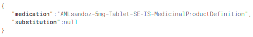
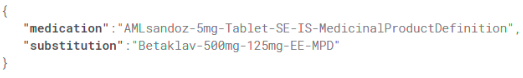

# UNICOM Healthcare Provider App

This [Flutter](https://docs.flutter.dev/get-started/install) app, along with the Patient Facing Apps, is critical to the cross-border drug substitution flow. 

The end user of this app is a healthcare provider.

The task of this app is to read the QR Code generated by a Patient Facing App and generate a list of substitute 
medications, giving a healthcare provider the ability to select the medication most similar to the one chosen by the 
patient. After that, the app will generate a QR Code for a Patient Facing App to scan in order to add the medication 
to its own medication list.

## Gravitate-UNICOM Demonstrator Integration

### QR Code Validation
The app validates QR codes from the Patient Facing App by checking for the presence of the field:
```json
{
  "gravitate-unicom-demonstrator": true,
  "medicationId": "amlo-norway",
  "name": "Amlodipin sandoz 10 mg TABLETTER",
  "timestamp": "2025-12-01T10:12:04.166554"
}
```

Only QR codes containing `"gravitate-unicom-demonstrator": true` will be accepted and processed.

### FHIR Data Source
After successful QR code validation, the app fetches real medication data from the UNICOM FHIR sandbox:
- **Endpoint**: `https://sandbox.hl7europe.eu/unicom/fhir/MedicinalProductDefinition`
- **Query Parameters**: `product-classification=C08CA01&country=100000000430`
- This provides a list of substitute medications with the same active substance

### Generated QR Code Format
When a healthcare provider selects a substitute medication, the app generates a QR code with the following structure:
```json
{
  "gravitate-unicom-demonstrator": true,
  "substitute_medication": "AMLODIPINA DOC GENERICI compresse 10 mg",
  "id": "medication-id"
}
```

This QR code can be scanned by the Patient Facing App to add the substitute medication to the patient's medication list.

---

## QR Code Examples

The QR Codes generated by the apps represent a json consisting of two keys: medication and substitution.

The medication key will correspond to the mpid of the medication selected by the patient, while the substitution key 
will correspond to the mpid of the replacement medication selected by the healthcare provider.

Below are two examples of QR codes with the equivalent json, the first is generated by the user facing app while the 
second is generated by the healthcare provider app.

### QR Code generated by Patient Facing App



### QR Code generated by Healthcare Provider App


